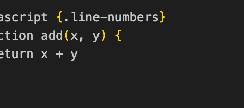
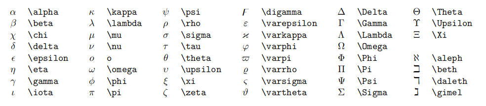

# 一些记笔记可能会参考的东西

## git操作
这些是各种场合常见的 Git 命令：

开始一个工作区（参见：git help tutorial）
   clone             克隆仓库到一个新目录
   init              创建一个空的 Git 仓库或重新初始化一个已存在的仓库

在当前变更上工作（参见：git help everyday）
   add               添加文件内容至索引
   mv                移动或重命名一个文件、目录或符号链接
   restore           恢复工作区文件
   rm                从工作区和索引中删除文件
   sparse-checkout   初始化及修改稀疏检出

检查历史和状态（参见：git help revisions）
   bisect            通过二分查找定位引入 bug 的提交
   diff              显示提交之间、提交和工作区之间等的差异
   grep              输出和模式匹配的行
   log               显示提交日志
   show              显示各种类型的对象
   status            显示工作区状态

扩展、标记和调校您的历史记录
   branch            列出、创建或删除分支
   commit            记录变更到仓库
   merge             合并两个或更多开发历史
   rebase            在另一个分支上重新应用提交
   reset             重置当前 HEAD 到指定状态
   switch            切换分支
   tag               创建、列出、删除或校验一个 GPG 签名的标签对象

协同（参见：git help workflows）
   fetch             从另外一个仓库下载对象和引用
   pull              获取并整合另外的仓库或一个本地分支
   push              更新远程引用和相关的对象
## 快捷键汇总
预览md
ctrl+k，v
通用操作
Ctrl + C, 复制当前文本
Ctrl + V, 粘贴当前文本
Ctrl + Z, 撤销
Ctrl + Shift + Z, 反撤销
Shift + Alt + F, 整理代码
Ctrl + /, 将当前行注释 / 反注释, 当多行文本被选中时, 将多行文本注释
光标操作
Ctrl + ← 将光标向左移动一个单词
Ctrl + → 将光标向右移动一个单词
Ctrl + Alt + ↑, 向上加入一个光标
Ctrl + Alt + ↓, 向下加入一个光标
Ctrl + Alt + U, 撤销上次光标操作
界面移动
Ctrl + ↑ 向上移动当前界面
Ctrl + → 向下移动当前界面
选中操作
Shift + ← 向左选中 / 反选中一个字符 (重要)
Shift + → 向右选中 / 反选中一个字符 (重要)
Ctrl + Shift + ← 向左选中 / 反选中一个单词 (重要)
Ctrl + Shift + → 向右选中 / 反选中一个单词 (重要)
Ctrl + D 当前有选中文本时, 将下一个与其相同的文本加入选中 (重要)
文本行操作
Ctrl + C 当前无选中文本时, 复制当前行
Shift + Alt + ↑ 向上复制当前行, 当多行文本被选中时, 向上复制多行 (重要)
Shift + Alt + ↓ 向下复制当前行, 当多行文本被选中时, 向下复制多行 (重要)
Alt + ↑ 向上移动当前行, 当多行文本被选中时, 将当前多行文本向上移动 (重要)
Alt + ↓ 向下移动当前行, 当多行文本被选中时, 将当前多行文本向下移动 (重要)


# 一级标题

## 二级标题

### 三级标题

每写完一个段落要隔一行空行.

就像这样, 隔了一行空行.

---

分割线

**重点加粗**

*斜体*

~~删除线~~

---
列表:

* 无序列表
  * 嵌套无序列表
  * 嵌套无序列表
* 无序列表
* 无序列表

1. 有序列表 1
   1. 嵌套有序列表 1
   2. 嵌套有序列表 2
2. 有序列表 2
3. 有序列表 3

---

引用文本:

> 引用别人说的话
> 就这样写
> By. OrangeX4

---

这是 `行内代码` 语法.

代码块语法:

''' python
print("Hello, World!")
'''

请将 ' 替换成 `.

---

[超链接名称](链接地址)


---

表格:

| 表头 | 表头 |
| ---- | ---- |
| 内容 | 内容 |
| 内容 | 内容 |

表格自动对其：Shift + Alt + F

---

注释:

<!-- 你看不见我 -->
任务列表:

- [x] 已经完成的事 1
- [x] 已经完成的事 2
- [x] 已经完成的事 3
- [ ] 仍未完成的事 4
- [ ] 仍未完成的事 5
  

```，
javascript {.line-numbers}
function add(x, y) {
  return x + y
}
```

如何直接将剪贴板内的图片保存
快捷键：ctrl+option+v


-------------

## 数学公式
行内公式: 

单位圆 $x^2+y^2=1$

公式块:

$$
\begin{cases}
x=\rho\cos\theta \\
y=\rho\sin\theta \\
\end{cases}
$$

1. 上标和下标
   上标 $x^2 + y^{12} = 1$
    上标 $x_1 + y_{12} = 1$
2. 分式
   较小的行内行分数 $\frac{1}{2}$

    展示型的分式 $\displaystyle\frac{x+1}{x-1}$
其中 \displaystyle 用于将行内展示转为块状展示.
3. 根式
   开平方 $\sqrt{2}$

    开 $n$ 次方 $\sqrt[n]{2}$
5. 累加，累乘，积分
   累加 $\sum_{k=1}^n\frac{1}{k}  \quad  \displaystyle\sum_{k=1}^n\frac{1}{k}$

累乘 $\prod_{k=1}^n\frac{1}{k}  \quad  \displaystyle\prod_{k=1}^n\frac{1}{k}$

积分 $\displaystyle \int_0^1x{\rm d}x  \quad  \iint_{D_{xy}}  \quad  \iiint_{\Omega_{xyz}}$
6. 括号修饰
   
圆括号 $\displaystyle \left(\sum_{k=1}^{n}\frac{1}{k} \right)^2$

方括号 $\displaystyle \left[\sum_{k=1}^{n}\frac{1}{k} \right]^2$

花括号 $\displaystyle \left\{\sum_{k=1}^{n}\frac{1}{k} \right\}^2$

尖括号 $\displaystyle \left\langle\sum_{k=1}^{n}\frac{1}{k} \right\rangle^2$
7. 多行算式对其
   居中:

$$
\begin{aligned}
y &=(x+5)^2-(x+1)^2 \\
&=(x^2+10x+25)-(x^2+2x+1) \\
&=8x+24 \\
\end{aligned}
$$

左对齐:

$
\begin{aligned}
y &=(x+5)^2-(x+1)^2 \\
&=(x^2+10x+25)-(x^2+2x+1) \\
&=8x+24 \\
\end{aligned}
$
8. 方程组
$$
\begin{cases}
k_{11}x_1+k_{12}x_2+\cdots+k_{1n}x_n=b_1 \\
k_{21}x_1+k_{22}x_2+\cdots+k_{2n}x_n=b_2 \\
\cdots \\
k_{n1}x_1+k_{n2}x_2+\cdots+k_{nn}x_n=b_n \\
\end{cases}
$$
9. 矩阵
矩阵:

$$
\begin{pmatrix}
1 & 1 & \cdots & 1 \\
1 & 1 & \cdots & 1 \\
\vdots & \vdots & \ddots & \vdots \\
1 & 1 & \cdots & 1 \\
\end{pmatrix}
$$
$$
\begin{bmatrix}
1 & 1 & \cdots & 1 \\
1 & 1 & \cdots & 1 \\
\vdots & \vdots & \ddots & \vdots \\
1 & 1 & \cdots & 1 \\
\end{bmatrix}
$$ 

行列式: 

$$
\begin{vmatrix}
1 & 1 & \cdots & 1 \\
1 & 1 & \cdots & 1 \\
\vdots & \vdots & \ddots & \vdots \\
1 & 1 & \cdots & 1 \\
\end{vmatrix}
$$  
10. 特殊字符
    
11. 零碎的重要语法
    点乘 $\cdot$, 叉乘 $\times$, 异或 $\otimes$, 直和 $\oplus$, 加减 $\pm$, 复合 $\circ$.
小于等于 $\leq$, 大于等于 $\geq$, 不等 $\neq$, 恒等 $\equiv$, 约等 $\approx$, 等价 $\cong$, 相似 $\sim$, 相似等于 $\simeq$, 点等 $\doteq$.
逻辑与 $\land$, 逻辑或 $\lor$, 逻辑非 $\lnot$, 蕴涵 $\to$, 等价 $\leftrightarrow$.
因为 $\because$, 所以 $\therefore$, 存在 $\exist$, 任意 $\forall$.
左小箭头 $\leftarrow$, 右小箭头 $\rightarrow$, 左大箭头 $\Leftarrow$, 右大箭头 $\Rightarrow$, 右长箭头 $\xrightarrow[fgh]{abcde}$.
属于 $\in$, 包含于 $\subset$, 真包含于 $\subseteq$, 交 $\cap$, 并 $\cup$, 空集 $\empty$
短向量 $\vec{x}$, 长向量 $\overrightarrow{AB}$, 上横线 $\overline{p}$.
无限 $\infty$, 极限 $\lim$, 微分 ${\rm d}$, 偏导 $\partial$, 点求导 $\dot{y}$, 点二阶导 $\ddot{y}$, 变化量 $\Delta$, 梯度 $\nabla$.
横省略 $\cdots$, 竖省略 $\vdots$, 斜省略 $\ddots$.
常见函数 $\sin$, $\cos$, $\tan$, $\arcsin$, $\arccos$, $\arctan$, $\ln$, $\log$, $\exp$.

-----------
### 快速计算
$\frac{d}{dx}{x^3+x^2+1$}